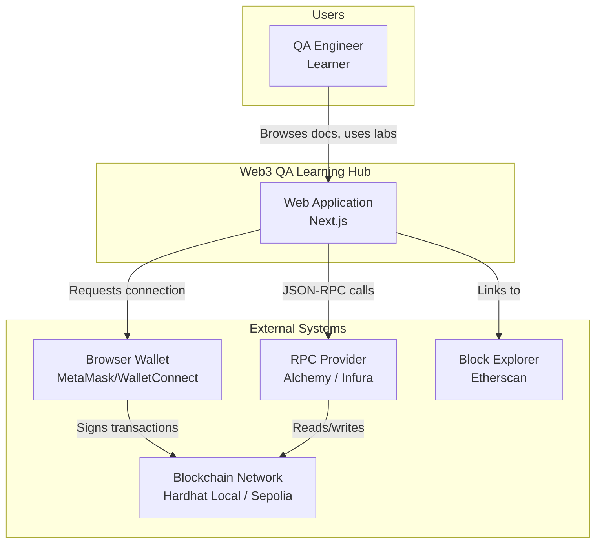
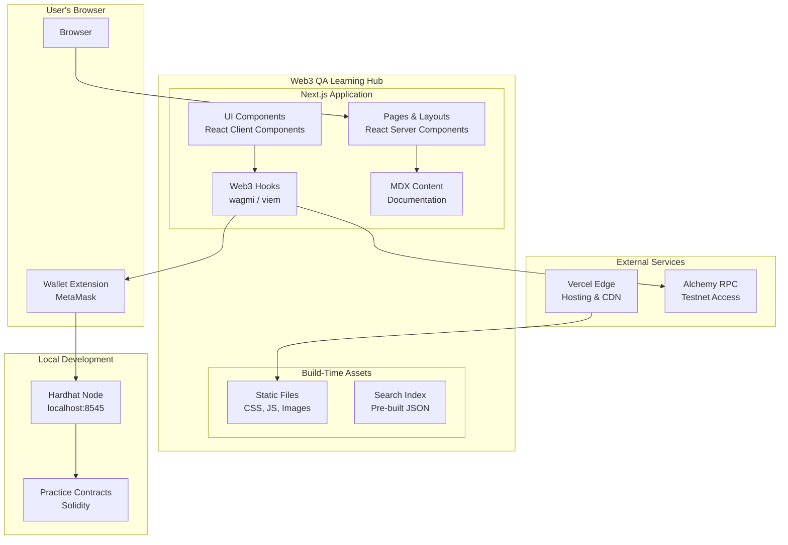
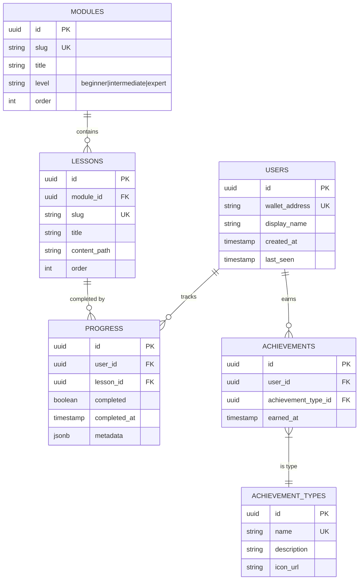
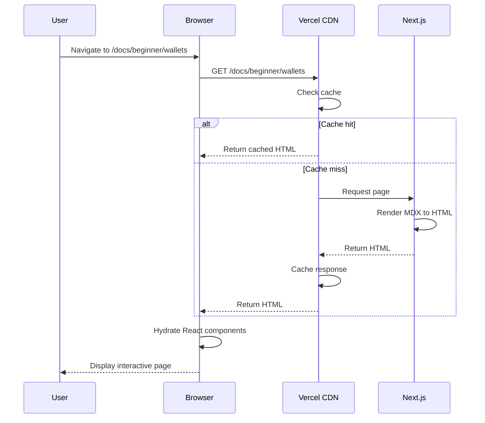
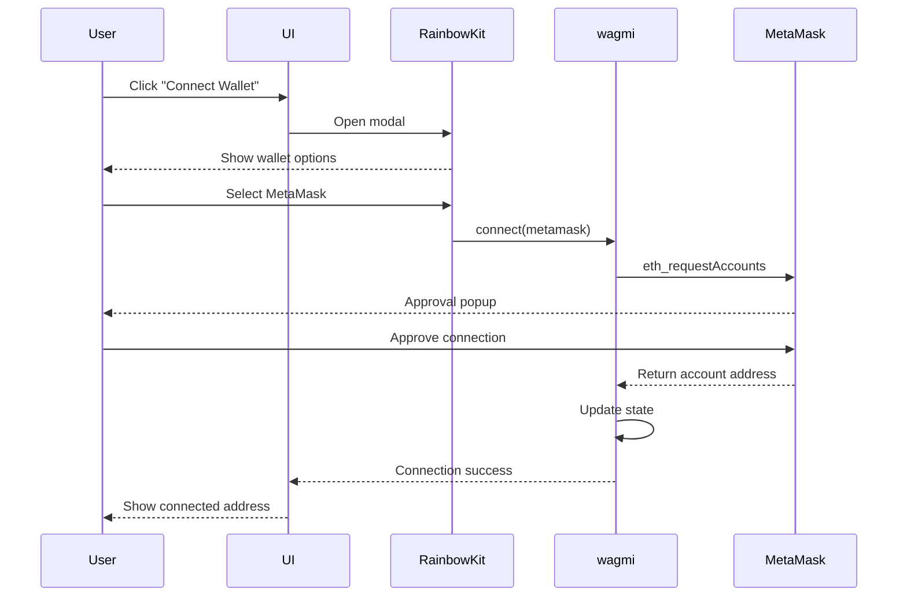
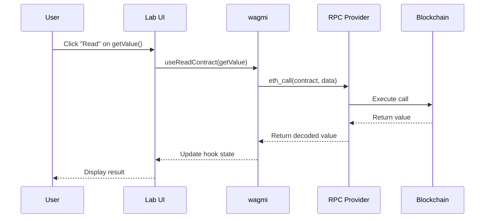
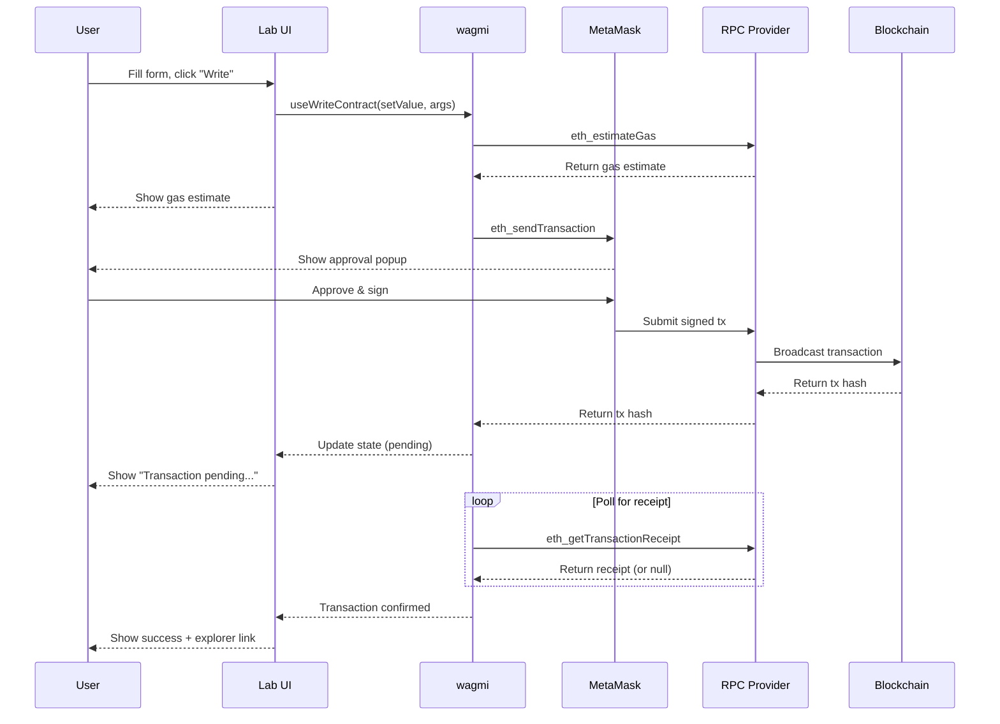
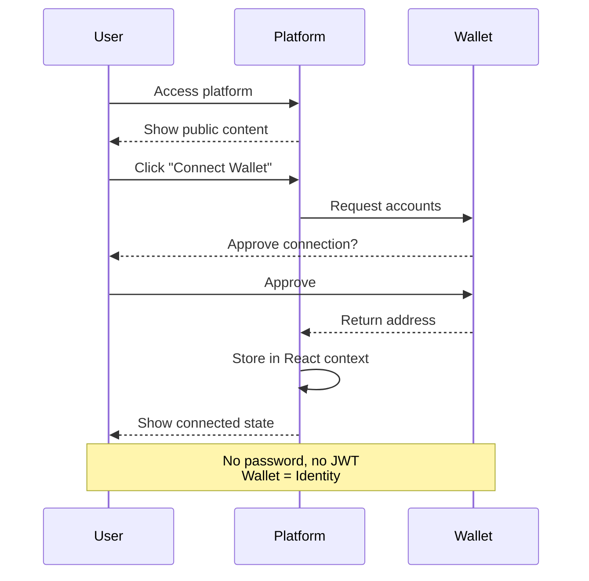
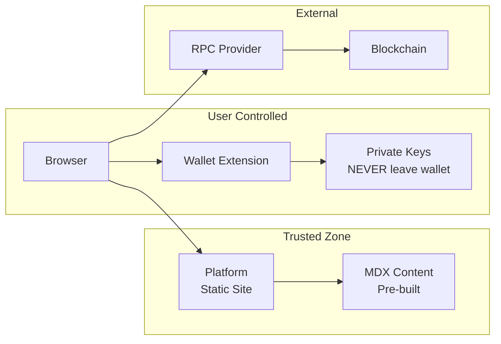
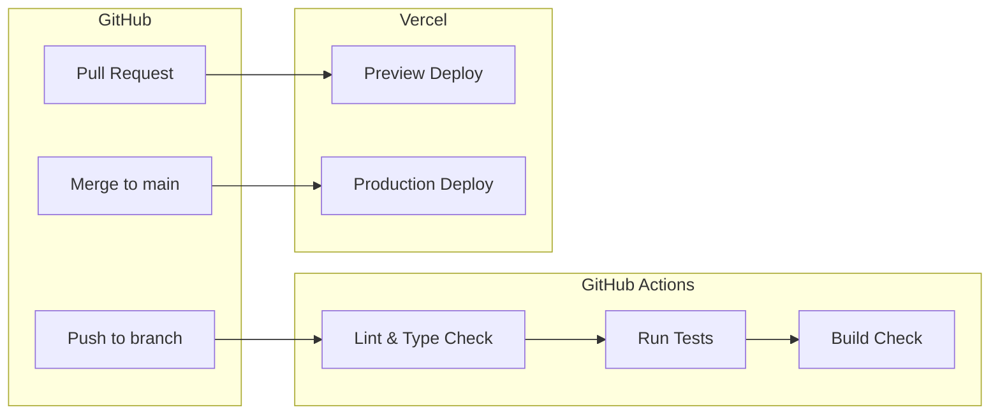

# Architecture Specifications: Web3 QA Learning Hub

## Overview

This document describes the system architecture, technology decisions, and data flows for the Web3 QA Learning Hub platform.

---

## 1. System Architecture

### C4 Level 1: System Context



### C4 Level 2: Container Diagram



### Component Responsibilities

| Component | Responsibility |
|-----------|----------------|
| **Pages & Layouts** | Route handling, SSR/SSG, page structure |
| **UI Components** | Interactive elements, forms, modals |
| **Web3 Hooks** | Wallet connection, contract interactions |
| **MDX Content** | Documentation rendering, embedded components |
| **Search Index** | Client-side full-text search |
| **Hardhat Node** | Local blockchain for practice |
| **Practice Contracts** | Smart contracts for testing scenarios |

---

## 2. Database Design

### MVP Note

**The MVP is stateless** - no user data is persisted. All state is:
- Client-side (React state, wagmi context)
- Browser storage (localStorage for preferences)
- On-chain (blockchain state)

### Future Database Schema (Post-MVP)

When user accounts and progress tracking are added, the schema will be managed via **Supabase migrations**. Below is the conceptual ERD:



### Data Storage Strategy

| Data Type | Storage | Persistence |
|-----------|---------|-------------|
| Wallet connection | wagmi context | Session only |
| UI preferences | localStorage | Browser persistent |
| Search queries | React state | None |
| Transaction history | On-chain | Blockchain permanent |
| User progress | Supabase (future) | Cloud persistent |

---

## 3. Tech Stack Justification

### Frontend Framework

**Next.js 15 (App Router)**

| Aspect | Details |
|--------|---------|
| ✅ **React Server Components** | Better performance, reduced client JS |
| ✅ **File-based routing** | Intuitive, matches content structure |
| ✅ **Static generation** | MDX pre-rendered at build time |
| ✅ **API routes** | Built-in serverless functions if needed |
| ✅ **Vercel integration** | Zero-config deployment |
| ❌ **Trade-off** | App Router learning curve; newer patterns |

### Language

**TypeScript (Strict Mode)**

| Aspect | Details |
|--------|---------|
| ✅ **Type safety** | Catch errors at compile time |
| ✅ **IDE support** | Autocomplete, refactoring |
| ✅ **ABI typing** | viem generates types from ABIs |
| ✅ **Documentation** | Types serve as inline docs |
| ❌ **Trade-off** | Slightly slower initial development |

### Styling

**Tailwind CSS**

| Aspect | Details |
|--------|---------|
| ✅ **Utility-first** | Rapid prototyping |
| ✅ **Purge unused** | Minimal production CSS |
| ✅ **Consistent design** | Design tokens built-in |
| ✅ **Dark mode** | Built-in support |
| ❌ **Trade-off** | Verbose class names; learning curve |

### Web3 Stack

**wagmi + viem + RainbowKit**

| Aspect | Details |
|--------|---------|
| ✅ **Type-safe** | Full TypeScript support |
| ✅ **React hooks** | Idiomatic React patterns |
| ✅ **RainbowKit UI** | Beautiful wallet modal out-of-box |
| ✅ **Multi-wallet** | MetaMask, WalletConnect, Coinbase |
| ✅ **viem efficiency** | Smaller bundle than ethers.js |
| ❌ **Trade-off** | Less community content than ethers |

### Documentation

**MDX (via next-mdx-remote or Contentlayer)**

| Aspect | Details |
|--------|---------|
| ✅ **React in Markdown** | Embed interactive components |
| ✅ **Static generation** | Pre-rendered at build time |
| ✅ **Frontmatter** | Metadata for navigation, ordering |
| ✅ **Code blocks** | Syntax highlighting built-in |
| ❌ **Trade-off** | Build complexity; component registration |

### Smart Contracts

**Hardhat**

| Aspect | Details |
|--------|---------|
| ✅ **Local blockchain** | Free, fast, deterministic |
| ✅ **TypeScript support** | Config and scripts in TS |
| ✅ **Console.log** | Debug contracts easily |
| ✅ **Forking** | Fork mainnet for realistic tests |
| ❌ **Trade-off** | Slower than Foundry; larger deps |

### Testing

**Playwright + Synpress (Future)**

| Aspect | Details |
|--------|---------|
| ✅ **Playwright** | Modern, fast, reliable E2E |
| ✅ **Synpress** | MetaMask automation |
| ✅ **Cross-browser** | Chrome, Firefox, WebKit |
| ✅ **TypeScript** | Type-safe test code |
| ❌ **Trade-off** | Synpress has breaking changes; maintenance |

### Deployment

**Vercel**

| Aspect | Details |
|--------|---------|
| ✅ **Zero-config** | Auto-detect Next.js settings |
| ✅ **Edge network** | Global CDN |
| ✅ **Preview deploys** | Every PR gets a URL |
| ✅ **Analytics** | Core Web Vitals built-in |
| ❌ **Trade-off** | Vendor lock-in; pricing at scale |

---

## 4. Data Flow

### Flow 1: Documentation Page Load



### Flow 2: Wallet Connection



### Flow 3: Smart Contract Read Operation



### Flow 4: Smart Contract Write Operation



---

## 5. Security Architecture

### Authentication Flow (MVP)

The MVP uses **wallet-based authentication** without traditional login:



### Security Boundaries



### Key Security Principles

| Principle | Implementation |
|-----------|----------------|
| **Private keys never touch platform** | All signing in wallet |
| **No backend auth in MVP** | Stateless, public content |
| **Input validation** | Zod schemas, address validation |
| **HTTPS only** | Enforced by Vercel |
| **CSP headers** | Restrict script sources |
| **No sensitive storage** | No cookies, no tokens |

### Threat Model

| Threat | Mitigation |
|--------|------------|
| **XSS attacks** | React escaping, CSP headers |
| **Phishing** | No password entry, wallet-based auth |
| **MITM attacks** | HTTPS enforced |
| **Malicious contracts** | Practice contracts are auditable, open source |
| **RPC manipulation** | Use trusted providers (Alchemy, Infura) |

---

## 6. Deployment Architecture

### Environment Configuration

| Environment | URL | Purpose |
|-------------|-----|---------|
| **Local** | localhost:3000 | Development |
| **Preview** | *.vercel.app | PR previews |
| **Production** | web3qa.dev (TBD) | Live site |

### CI/CD Pipeline



### Environment Variables

| Variable | Description | Required |
|----------|-------------|----------|
| `NEXT_PUBLIC_ALCHEMY_ID` | Alchemy API key | Production |
| `NEXT_PUBLIC_WALLETCONNECT_ID` | WalletConnect project ID | Production |
| `NEXT_PUBLIC_CHAIN_ID` | Default chain (1, 11155111, 31337) | Yes |

---

## 7. Directory Structure

```
/
├── app/                      # Next.js App Router
│   ├── layout.tsx           # Root layout with providers
│   ├── page.tsx             # Home page
│   ├── docs/                # Documentation pages
│   │   └── [...slug]/
│   │       └── page.tsx
│   └── lab/                 # Lab pages
│       └── [...slug]/
│           └── page.tsx
├── components/              # React components
│   ├── ui/                  # Base UI components
│   ├── web3/                # Web3-specific components
│   ├── docs/                # Documentation components
│   └── lab/                 # Lab components
├── content/                 # MDX content
│   ├── beginner/
│   ├── intermediate/
│   └── expert/
├── contracts/               # Hardhat project
│   ├── contracts/           # Solidity files
│   ├── scripts/             # Deploy scripts
│   └── hardhat.config.ts
├── hooks/                   # Custom React hooks
├── lib/                     # Utility functions
├── styles/                  # Global styles
├── tests/                   # Test files
│   ├── unit/
│   └── e2e/
└── public/                  # Static assets
```

---

## Summary

| Aspect | Decision |
|--------|----------|
| **Architecture** | Static-first with client-side Web3 |
| **Frontend** | Next.js 15 + TypeScript + Tailwind |
| **Web3** | wagmi + viem + RainbowKit |
| **Content** | MDX with embedded components |
| **Local Dev** | Hardhat for blockchain |
| **Deployment** | Vercel Edge |
| **Database** | None (MVP is stateless) |
| **Auth** | Wallet-based only |
